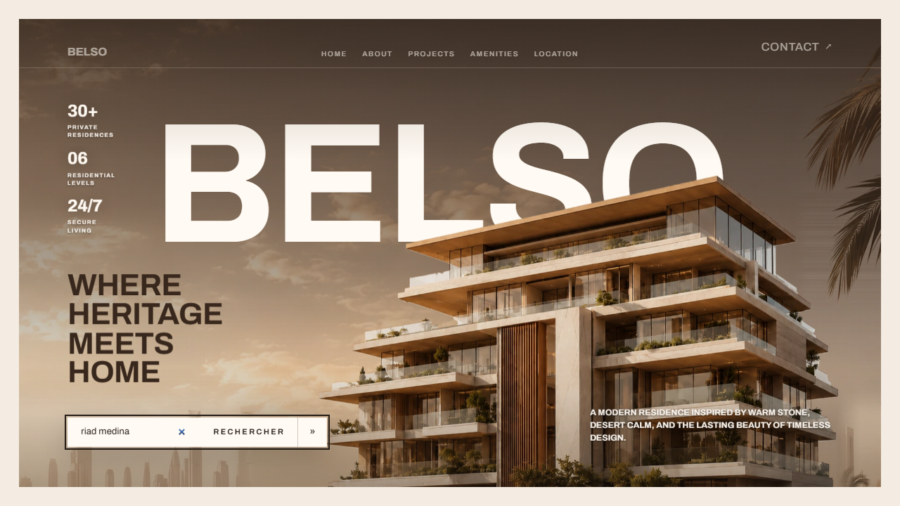
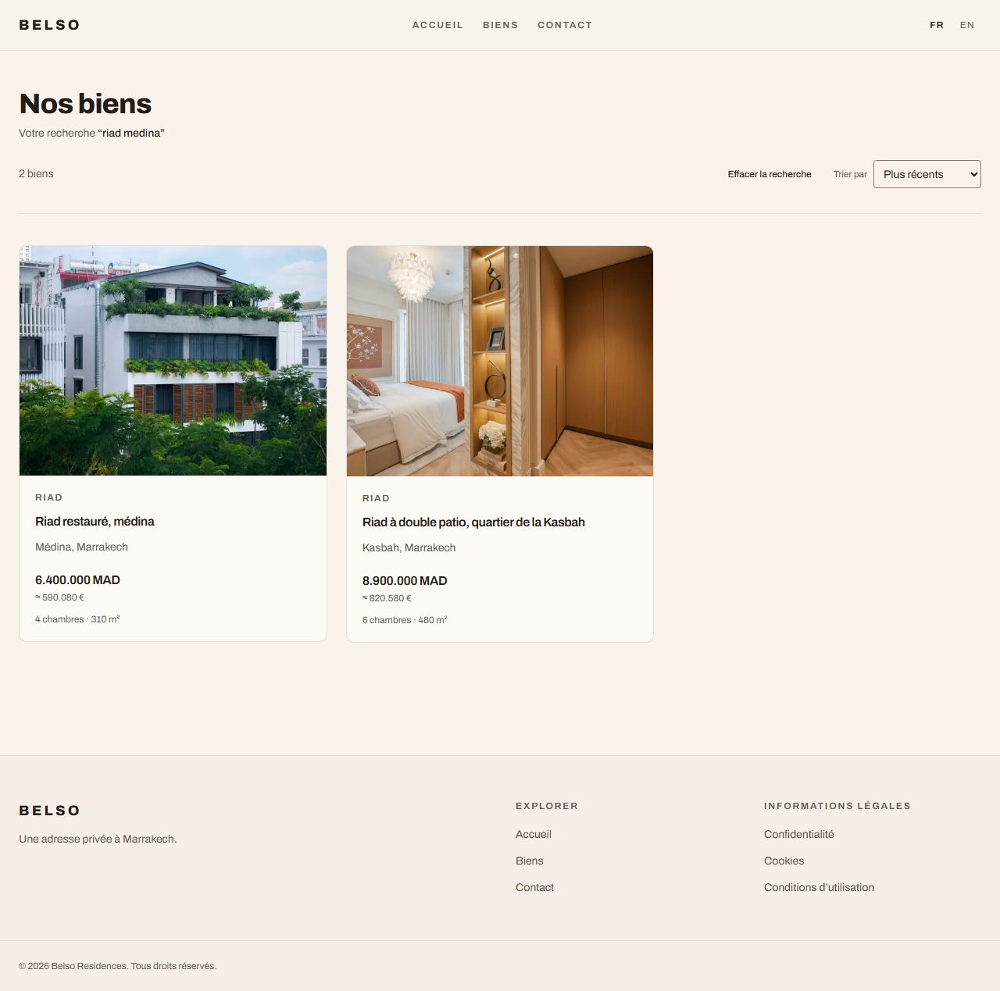
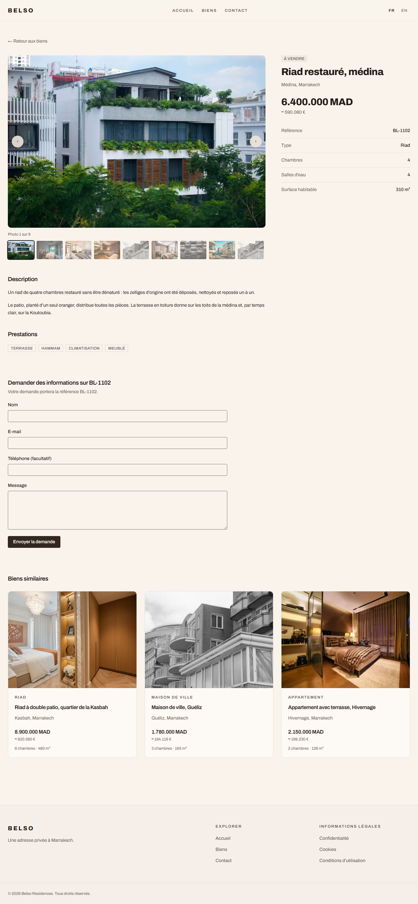
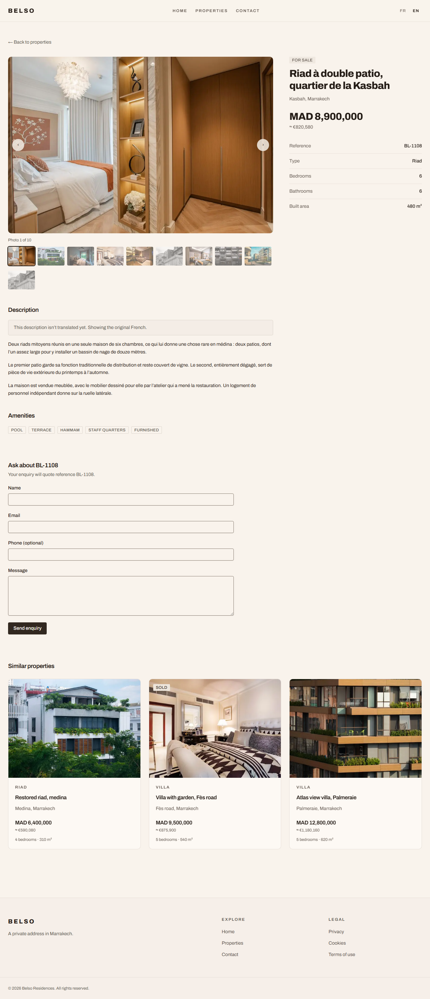
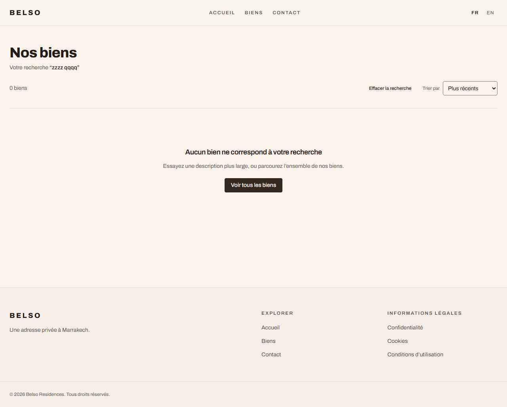
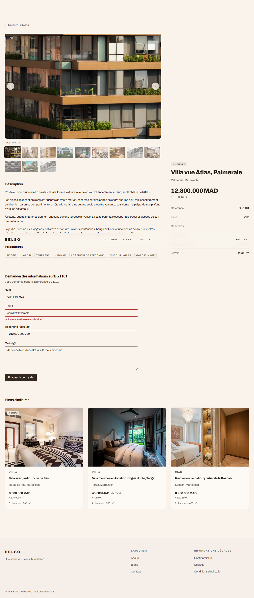
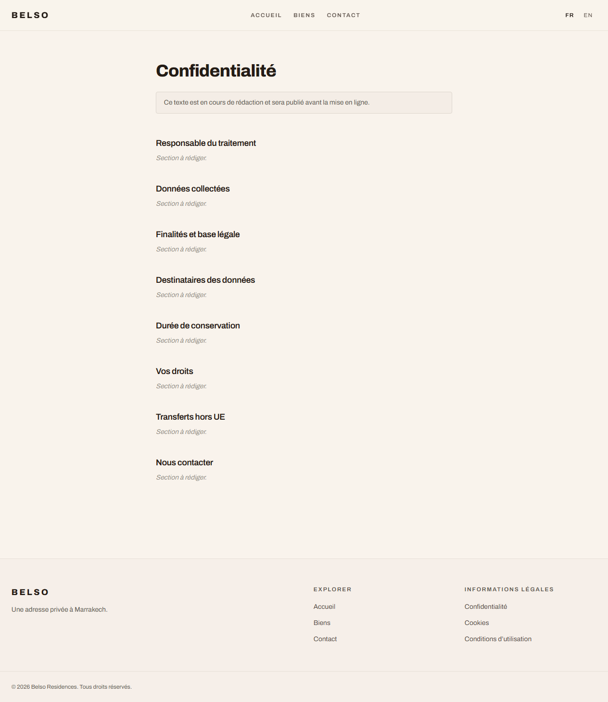
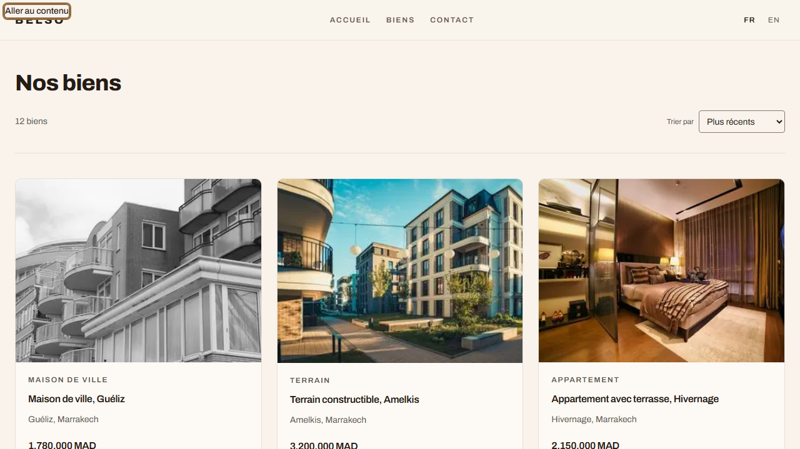

# Feature report — 004 Belso Luxury public storefront

- **Spec:** [specs/004-belso-public](../../specs/004-belso-public/spec.md) · **Status:** ready for review
- **Date:** 2026-08-17 · **Author:** Claude (agent-implemented) · **Branch:** `feat/004-belso-public`

## What & why

Belso Luxury had a cinematic landing page whose own navigation pointed at nothing. An agency selling above 500 000 € is judged on first impression, and a beautiful entrance opening onto dead links is worse than no site.

This ships the storefront behind it: a search field at the centre of the scene, a listings index, a listing detail page with gallery and enquiry form, a contact page, three legal documents, and the language routing all of it sits on. Content comes from fixtures; enquiries are a painted door.

## Acceptance criteria → evidence

| AC                                     | Proven by                                                                            | Evidence                                                                                                                | Verdict |
| -------------------------------------- | ------------------------------------------------------------------------------------ | ----------------------------------------------------------------------------------------------------------------------- | ------- |
| AC-1 language detected, switched, kept | `core/i18n.test.ts`, `proxy.test.ts` (19) · `e2e/i18n.spec.ts` (8)                   | [locale switch](004-belso-public/img/02-results.png)                                                                    | PASS    |
| AC-2 search echoes the visitor's words | `e2e/properties.spec.ts` step 1–2                                                    | [hero](004-belso-public/img/01-home-search.png)                                                                         | PASS    |
| AC-3 result content + reordering       | `lib.test.ts` sort comparators · `e2e/properties.spec.ts`                            | [results](004-belso-public/img/02-results.png)                                                                          | PASS    |
| AC-4 empty search says so, offers exit | `e2e/properties.spec.ts` "matches nothing"                                           | [empty](004-belso-public/img/05-empty-results.png)                                                                      | PASS    |
| AC-5 gallery, facts, price, similar    | `e2e/properties.spec.ts` step 4 + gallery advance                                    | [detail](004-belso-public/img/03-detail.png)                                                                            | PASS    |
| AC-6 form knows the property           | `enquiry-form.test.tsx` · `e2e/enquiry.spec.ts`                                      | [contact](004-belso-public/img/13-contact-confirmed.png)                                                                | PASS    |
| AC-7 bad email explained, input kept   | `actions.test.ts` (9) · `e2e/enquiry.spec.ts`                                        | [validation](004-belso-public/img/12-enquiry-invalid-email.png)                                                         | PASS    |
| AC-8 unknown address → real 404        | `e2e/properties.spec.ts`, `e2e/enquiry.spec.ts` (status asserted, not just the page) | [not found](004-belso-public/img/08-not-found.png)                                                                      | PASS    |
| AC-9 untranslated shows French + note  | `lib.test.ts` `resolveTranslation` · `e2e/properties.spec.ts`                        | [fallback](004-belso-public/img/07-fallback-translation.png)                                                            | PASS    |
| AC-10 every chrome link resolves       | `e2e/enquiry.spec.ts` crawls every header/footer link in both locales                | [legal](004-belso-public/img/14-legal-privacy.png)                                                                      | PASS    |
| AC-11 keyboard + reduced motion        | `e2e/a11y.spec.ts` (6)                                                               | [skip link](004-belso-public/img/16-skip-link-focused.png) · [reduced](004-belso-public/img/17-reduced-motion-hero.png) | PASS    |

## Screenshots

|                                                                                                 |                                                                                                    |
| ----------------------------------------------------------------------------------------------- | -------------------------------------------------------------------------------------------------- |
|  The search field at the centre of the scene    |  Query echoed back, count, sort                     |
|  Gallery, key facts, dual-currency price, similar  |  English page, French prose, the note |
|  Nothing matched — with a way onward         |  One field wrong, nothing lost     |
|  Structure shipped, copy marked as unwritten |  First tab stop reaches the content         |

## Changes by layer

- **`core`** — `i18n.ts` (locale list, translated segment map, detection), `currency.ts` (provisional rate table, B-4).
- **`app`** — two root layouts via route groups so `<html lang>` can name the actual language; `(content)` group carrying header/footer; listings, detail, contact and legal routes with their loading/error/not-found states.
- **`features/properties`** — types, twelve fixtures, `server-only` repository seam, and the pure logic (translation fallback, matcher, sorts, similarity).
- **`features/enquiries`** — zod schema, painted-door Server Action, form.
- **`features/i18n`** — dictionaries (fr is the source of truth, en typed against it), locale switcher, legal document structure.
- **`e2e`** — four specs, 28 tests, screenshot evidence per step.

## Verification

- `pnpm verify` green: lint (0 errors, 2 pre-existing warnings) · typecheck · format · docs links · typography · **115 unit tests** · production build.
- `CI=true pnpm e2e` green: **28 tests**, production build, one worker. Screenshots captured and inspected against the ACs.
- Security review against `docs/security/checklist.md` — see below.

### Bugs found by verification, not by review

Four defects reached working code and were caught by driving the app rather than reading it. They are listed because each one presented as fine:

1. **A `loading.tsx` above a route turns its 404 into a soft 200.** The shell streams before `notFound()` throws, so the status is already sent. The page looked correct and returned 200 to every crawler. Restructured so the listings skeleton no longer wraps `[slug]`.
2. **A prefetch silently overwrote the visitor's chosen language.** The switcher is in every page's header, so Next prefetches the other language's URL; the proxy counted that as a choice. Surfaced as a flaky test — the test was right. Fixed via `Sec-Fetch-Dest`, after discovering that **Next strips its own router headers before `proxy` runs**.
3. **No listing showed a focus ring.** The card's stretched link suppressed its outline with no replacement, so the entire grid was invisible to keyboard focus — on a page that screenshots perfectly.
4. **Price sorting compared raw numbers across currencies**, ranking a 12.8M MAD villa above a €3.9M estate. Both sort tests passed, because they asserted the same wrong premise.

## Security review (`docs/security/checklist.md`)

| Rule           | Finding                                                                                                                                                                                                            | Status  |
| -------------- | ------------------------------------------------------------------------------------------------------------------------------------------------------------------------------------------------------------------ | ------- |
| SEC-INPUT-001  | Listings `searchParams` were read raw (`q` unbounded). Now `propertySearchParamsSchema`, with `catch` so a stale `?sort=` degrades instead of 500ing. Tests added.                                                 | FIXED   |
| SEC-SUPPLY-001 | `next@16.2.7` carried 9 advisories incl. **middleware/proxy bypass in App Router + Turbopack + locale** — this app's exact shape, on the path that gates `/account`. Bumped to 16.3.1; all 9 cleared, `sharp` too. | FIXED   |
| SEC-INPUT-001  | Enquiry action zod-parses every field; it is the only untrusted write path.                                                                                                                                        | PASS    |
| SEC-LOG-001    | The action logs failing **field names**, never the payload (name, email, phone).                                                                                                                                   | PASS    |
| SEC-CSRF-001   | The only mutation is a Server Action, CSRF-safe by default. No route handlers added.                                                                                                                               | PASS    |
| SEC-REDIR-001  | The proxy's redirect is built on a cloned same-origin URL with a locale from a closed set — no user-controlled destination.                                                                                        | PASS    |
| SEC-ENV-001    | No `process.env` read outside `src/core`.                                                                                                                                                                          | PASS    |
| SEC-NET-001    | Headers unchanged by this branch.                                                                                                                                                                                  | PASS    |
| SEC-RATE-001   | The enquiry action is unthrottled. Harmless while it persists nothing; **must be rate-limited before it becomes real** (spec 003).                                                                                 | OPEN P3 |
| SEC-SUPPLY-001 | 15 high advisories remain, all transitive build/dev dependencies (postcss, nanoid, eslint, commitlint, jsdom/undici) with no upstream fix available.                                                               | OPEN P2 |

## Follow-ups

Ordered by how much they matter.

1. **The home scene is not translated.** Its nav, lede, headings and Contact button are hardcoded English in `cinematic-scroll/data.ts`, so `/fr` shows French search chrome inside an English scene. This is the largest remaining gap against "the whole site is available in French and English". Its nav also points at in-page anchors and its Contact is a dead `<button>`, which AC-10 forbids.
2. **Legal copy has no owner.** Structure and the GDPR-expected sections ship; the spec's open question about who supplies the text is still open. Pages are `noindex` until it lands.
3. **`.claude/rules/app-router.md` mandates `loading.tsx` on every feature route** — which, per finding 1, is a soft-404 generator for any route that can call `notFound()`. Worth `/encode-lesson`.
4. **Prices render `12.000.000 MAD`** — `fr-MA`'s CLDR grouping separator is `.`, which a French-from-France buyer may read as wrong. One-line change in `core/i18n` `localeTag`; raised with B-7.
5. **B-3, B-4 and B-7 remain provisional** — property/amenity vocabulary, the exchange-rate rule, and final typography. Each is a union or token swap, not a rewrite.
