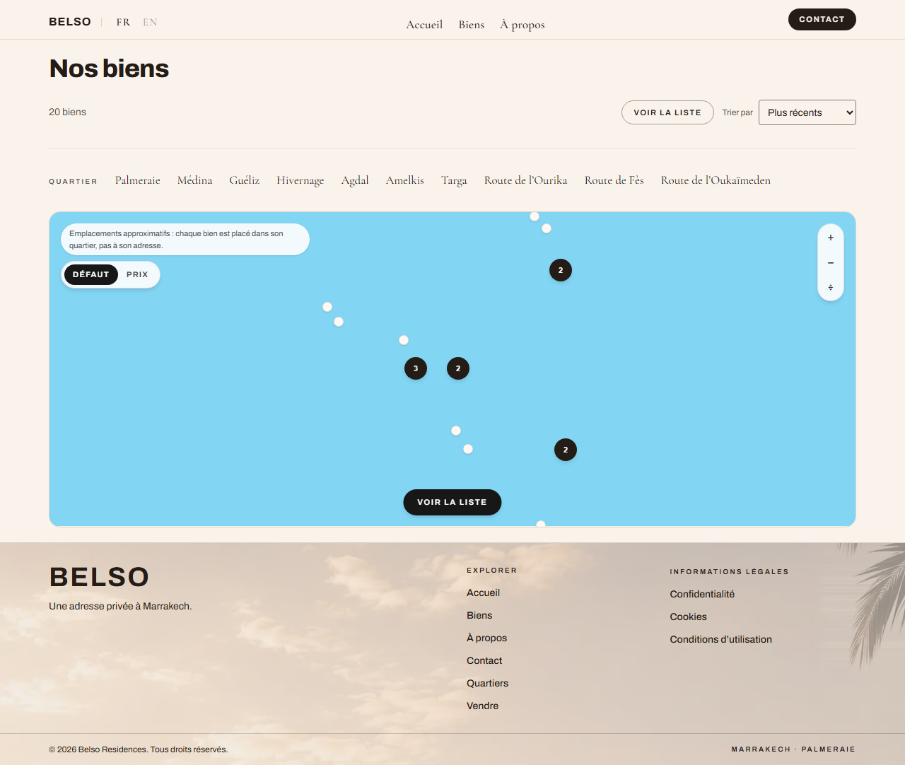
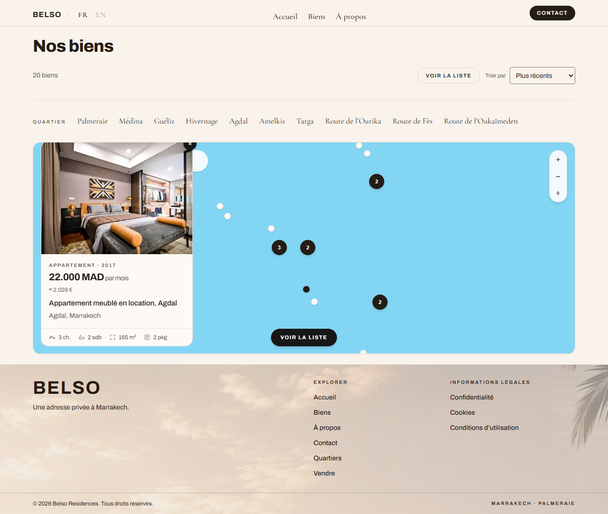
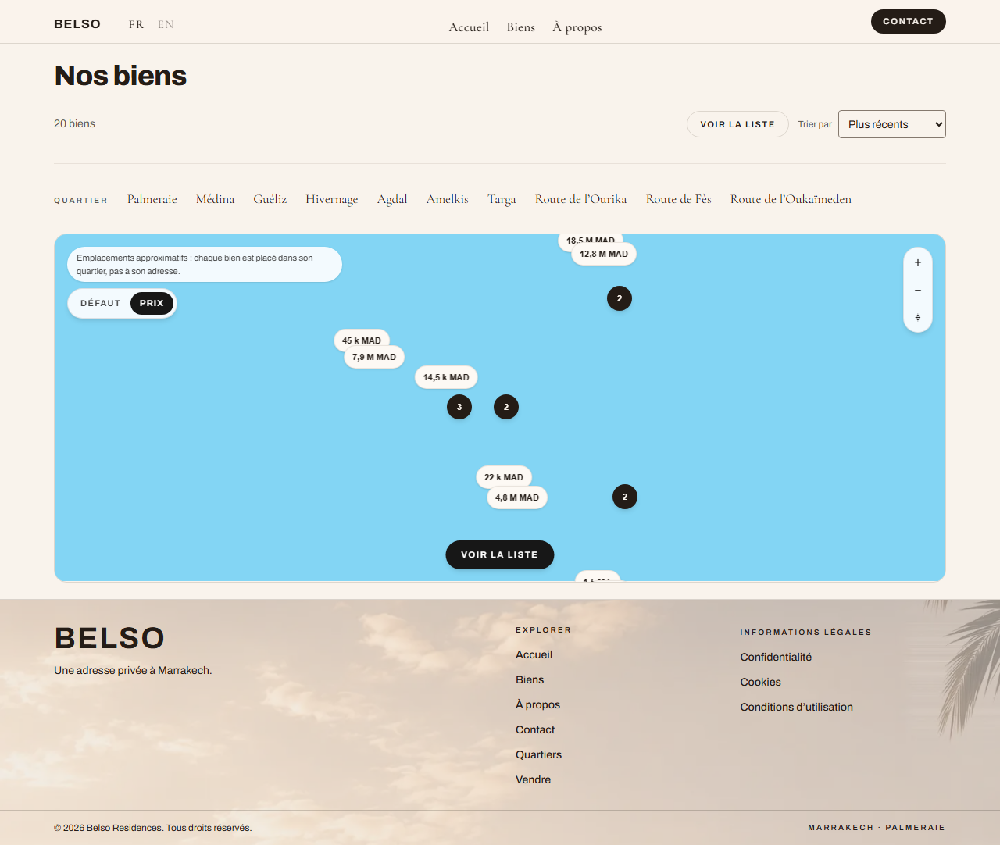

# Feature report — 009 Map view for the listings catalogue

- **Spec:** [specs/009-belso-map/spec.md](../../specs/009-belso-map/spec.md) · [plan](../../specs/009-belso-map/plan.md) · [tasks](../../specs/009-belso-map/tasks.md)
- **ADR:** [0009 — MapLibre GL JS + hosted vector tiles](../architecture/decisions/0009-maplibre-for-the-listings-map.md)
- **Branch / commits:** `main` · `ab27c1c` → `1e114dd` (3 commits)
- **Date:** 2026-08-28 · **Author:** Houssem Ferrani (+ Claude)

## What & why

The client asked for a map like JamesEdition's, with the back-office feeding it. A map was
scoped into spec 004 and shipped without one, for a reason recorded at the time: inventing a
point for a private residence is not a rounding error. This spec builds the map so that it is
honest about what it does not know, and sharpens by itself when real addresses arrive.

Visitors can now flip the catalogue to a full-bleed map at `?view=map`, see where the listings
are, and open any of them from it — carrying their search and sort with them in the URL.

## Acceptance criteria → evidence

| AC       | Proven by                                                                                       | Screenshot                                  | Verdict    |
| -------- | ----------------------------------------------------------------------------------------------- | ------------------------------------------- | ---------- |
| **AC-1** | `e2e/map.spec.ts` — "a visitor opens the map…" + "the view is in the address…" (URL, reload)    | [30-map](009-belso-map/img/30-map.png)      | ✅ pass    |
| **AC-2** | `e2e/map.spec.ts` — opens a pin, asserts the card names that property, follows it to its page   | [31](009-belso-map/img/31-map-property.png) | ✅ pass    |
| **AC-3** | `e2e/map.spec.ts` — "properties standing together are one marker, and it separates when opened" | [30-map](009-belso-map/img/30-map.png)      | ✅ pass    |
| **AC-4** | `e2e/map.spec.ts` — "the visitor can ask for prices on the points"                              | [32](009-belso-map/img/32-map-prices.png)   | ⚠️ partial |
| **AC-5** | `lib.test.ts` (precision derivation) + `e2e/map.spec.ts` asserts the caveat is on screen        | [30-map](009-belso-map/img/30-map.png)      | ✅ pass    |
| **AC-6** | `e2e/map.spec.ts` — asserts the **server response** carries ≥20 listings inside `<noscript>`    | —                                           | ✅ pass    |
| **AC-7** | `e2e/a11y.spec.ts` tab sweep; markers are real `<button>`s; reduced motion disables fly-to      | —                                           | ✅ pass    |
| **AC-8** | `e2e/map.spec.ts` — "with no satellite imagery configured, the choice is not offered"           | [30-map](009-belso-map/img/30-map.png)      | ✅ pass    |

**AC-4 is partial and deliberately not marked green.** The price half is proven — every pin
becomes its asking price. The satellite half is _unproven_, because no satellite style URL is
configured, so the control is hidden rather than offered broken. AC-8 asserts that hiding. The
satellite requirement is untested until a provider account exists.

Two ACs are proven without a screenshot, and that is the honest answer rather than a gap. AC-6
asserts the bytes we send, because Playwright's `javaScriptEnabled: false` does not flip the
flag Chrome styles `<noscript>` with — measured: the element attaches, its bounding box is null,
the cards inside it count zero. AC-7 is keyboard and motion behaviour, which a still frame
cannot show.

## Screenshots

_The map view: individual pins, clusters carrying a count, the approximate-location caveat, the
default/price toggle, and "Voir la liste" back to the grid. **The ground is blank blue** — see
Follow-ups._

_Opening a pin gives the photograph, the price in both currencies, the address and the facts
row, with a link into the listing. The selected pin darkens._

_"Prix" turns every unclustered pin into its asking price, compacted for a pin: `18,5 M MAD`,
`45 k MAD`, `22 k MAD`. Clusters keep their counts._

## Changes

**33 files, +1711 / −25.**

| Layer                | Files                                                                                             | Notable decisions                                                                                                                                                                                                                                                          |
| -------------------- | ------------------------------------------------------------------------------------------------- | -------------------------------------------------------------------------------------------------------------------------------------------------------------------------------------------------------------------------------------------------------------------------- |
| Feature (properties) | `components/property-map.tsx`, `use-property-map.ts`, `map-marker.tsx`, `property-map-loader.tsx` | Markers are real `<button>`s, not canvas — a `<canvas>` can never be focusable or announced. The loader file exists to hold `"use client"` + `ssr: false` **inside** the slice: the barrel re-exports `server-only`, and boundaries forbid `app` deep-importing internals. |
| Domain               | `types.ts`, `lib.ts`, `districts.ts`                                                              | **No coordinate is written into any fixture.** Districts carry a hand-placed centre; `resolveLocation` derives a stable point from a hash of the reference. `precision` is computed, never stored, so the caveat turns itself off when real addresses arrive.              |
| App                  | `properties/(index)/page.tsx`, `property-labels.ts`, `results-header.tsx`                         | `view` joins `q` and `sort` with `.catch("grid")` — a stale `?view=` is a typo, not a 500 (SEC-INPUT-001).                                                                                                                                                                 |
| Config / security    | `next.config.ts`, `env.client.ts`, `eslint.config.mjs`                                            | CSP gained `worker-src 'self'` and `child-src 'self'`, and `connect-src`/`img-src` were **narrowed** from wildcards to configured origins (SEC-NET-002). Serving the worker ourselves let CSP avoid `blob:` entirely.                                                      |
| Build                | `scripts/sync-map-worker.mjs`, `public/vendor/maplibre/*`                                         | **Turbopack does not emit MapLibre v6's ES-module worker.** The symptom is silent: style loads, no tile is parsed, `load` never fires, empty console. Ruled out CSP (ran with it bypassed) and WebGL (three back-ends) before finding it.                                  |

## Verification

| Gate               | Result                                                                                                                                   |
| ------------------ | ---------------------------------------------------------------------------------------------------------------------------------------- |
| `pnpm verify`      | ✅ green (lint 0 errors, typecheck, format, docs, typography, secrets, build)                                                            |
| Unit tests         | ✅ 138 passing at ship (140 today, +2 from spec 010)                                                                                     |
| `CI=true pnpm e2e` | ✅ 84/84, including 8 new in `e2e/map.spec.ts`                                                                                           |
| `e2e/map.spec.ts`  | ✅ 8/8 re-run for this report, against a production build (24.5s)                                                                        |
| Bundle             | Measured, not assumed: grid **990 KB**, map **1,932 KB** uncompressed JS. The difference is MapLibre, and the grid view pays none of it. |
| Persona review     | ❌ **not run** — `/review` and `/security-review` are outstanding (see below)                                                            |

A regression the existing suite caught during the work, worth recording: the view toggle beside
the sort control needed 400px of a 320px screen and pushed the whole page sideways. The action
row now wraps.

## Follow-ups

**Blocking a client demo:**

- **The ground renders blank blue.** MapLibre's keyless demo tiles carry no detail at city zoom.
  A MapTiler style URL in `NEXT_PUBLIC_MAP_STYLE_URL` makes it a real map of Marrakech; a second
  variable is needed before the Satellite control appears at all. **The open question in the spec
  — which provider account the client will hold, and which domain the key is restricted to — is
  still open**, and it gates both AC-4's satellite half and any demo.

**Cosmetic, found by inspecting these screenshots:**

- Price pills near the map's edge are **clipped** by the container — visible top and bottom in
  `32-map-prices.png`. The camera fits the markers, but the pills extend past them.
- The property card **covers the approximate-location caveat** when opened at this width
  (`31-map-property.png`).

**Process debt carried, not introduced:**

- `/review` and `/security-review` have not been run for this spec. A header change and a new
  dependency each trigger the latter. This report should not be read as a substitute.
- Lighthouse against LCP ≤ 2.5s / CLS ≤ 0.1 / INP < 200ms (task T4.5) was not run.
- Deferred by the client and recorded in the spec's _Out of scope_: the rentability calculator,
  and district polygons with hover statistics — both pending her data.
- Still unbuilt from `plan.md` Phase 3: the listing-detail locator map.
- The stock photography problem follows the map here: marker cards show the same six bedrooms.
  Real photography remains the binding constraint on the whole storefront.
