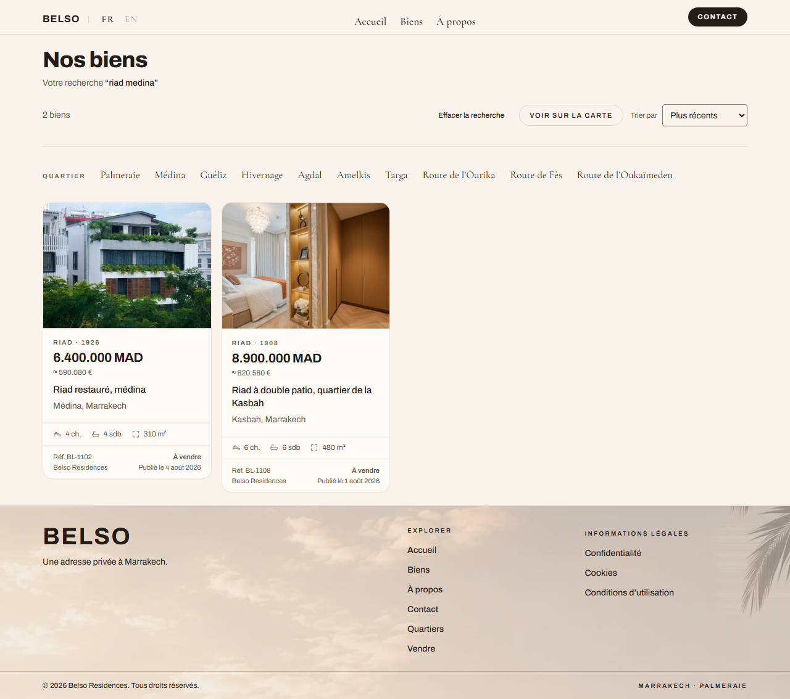
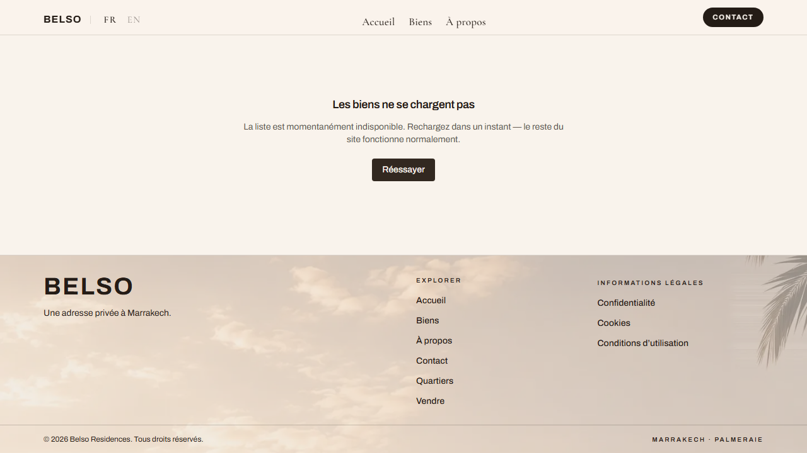
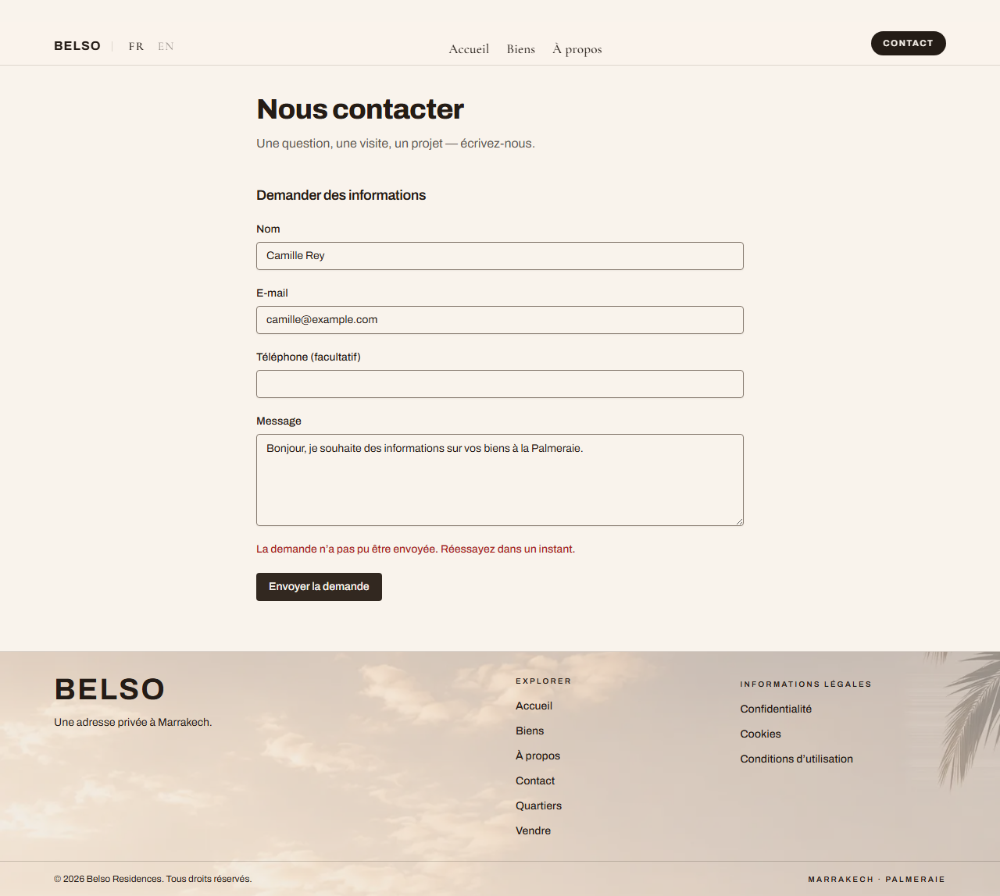

# Feature report — 010 Listings come from a database, not from fixtures

- **Spec:** [spec.md](../../specs/010-belso-data-layer/spec.md) · [plan](../../specs/010-belso-data-layer/plan.md) · [tasks](../../specs/010-belso-data-layer/tasks.md) · [AC coverage](../../specs/010-belso-data-layer/ac-coverage.md)
- **Decision:** [ADR-0008 — Postgres on our own VPS, no Supabase](../architecture/decisions/0008-postgres-on-our-own-vps.md) (supersedes 0007)
- **Branch / commits:** `main` · 17 commits · **71 files, +8990 / −67**
- **Date:** 2026-08-28 · **Author:** Houssem Ferrani (+ Claude)

## What & why

Every listing was a hand-written fixture, so the client could not add or remove a property
without a developer and a deploy. Visitor enquiries went nowhere — the contact form validated
exactly like the real thing and discarded every lead, which is the one thing the site exists to
produce.

The catalogue now lives in Postgres on a VPS the client owns, seeded from the twenty fixtures.
For a visitor **nothing changes**, and that is the point: this is the floor being replaced under
a finished room.

## Acceptance criteria → evidence

| AC       | Proven by                                                                                       | Evidence                                                                                                                    | Verdict    |
| -------- | ----------------------------------------------------------------------------------------------- | --------------------------------------------------------------------------------------------------------------------------- | ---------- |
| **AC-1** | `repository.golden.test.ts` vs Postgres — 113 queries, byte-for-byte                            | [02-results](010-belso-data-layer/img/02-results.png)                                                                       | ✅ pass    |
| **AC-2** | `e2e/draft-listing.spec.ts` — catalogue (fr+en), 404 on the direct URL, absent from the sitemap | —                                                                                                                           | ✅ pass    |
| **AC-3** | `repository.db.test.ts` — archived gone from the catalogue, record and translations retained    | —                                                                                                                           | ✅ pass    |
| **AC-4** | `enquiries.db.test.ts` — stored and linked, throttled, concurrency-safe                         | [11-enquiry](010-belso-data-layer/img/11-enquiry-confirmed.png)                                                             | ✅ pass    |
| **AC-5** | `e2e/db-down.spec.ts` with Postgres genuinely stopped                                           | [40](010-belso-data-layer/img/40-catalogue-database-down.png) · [42](010-belso-data-layer/img/42-enquiry-database-down.png) | ⚠️ partial |
| **AC-6** | `pnpm db:restore-check` — a real restore, then the site's own oracle against it                 | —                                                                                                                           | ✅ pass    |
| **AC-7** | `repository.db.test.ts` + the redirect wired into the detail page                               | —                                                                                                                           | ⚠️ partial |
| **AC-8** | `seed.db.test.ts` — three runs, every table compared                                            | —                                                                                                                           | ✅ pass    |

**Two are partial and are not being rounded up.** AC-5's tests only run with `DB_DOWN=1`, which
no gate sets — the behaviour is verified, the regression cover is not. AC-7's redirect exists and
has a unit test; the e2e step the task claimed does not.

**Six of these eight changed state after the review board.** The first version of this table
ticked all eight. Two criteria were ticked on tests that could not fail for the reason the
criterion describes, and one — AC-7 — was ticked for behaviour that did not exist at any route.
[ac-coverage.md](../../specs/010-belso-data-layer/ac-coverage.md) records each one.

## Screenshots

_A search for "riad medina" against the database: two results, dual currency, and
"Publié le 4 août 2026" — the date with no timezone applied, which is the conversion that had
already gone wrong once._

_Postgres genuinely stopped. The site keeps its chrome and says the catalogue is unavailable —
and, the assertion that matters, does **not** say "Aucun bien". An empty catalogue and an
unreachable one look identical to a visitor and mean opposite things._

_The visitor's words are still in the form and there is no false confirmation. A green tick over
a failed write is the worst outcome available here: the buyer stops chasing and nobody ever
learns the enquiry existed._

## Changes

| Layer       | Files                                              | Notable decisions                                                                                                                                                                                                  |
| ----------- | -------------------------------------------------- | ------------------------------------------------------------------------------------------------------------------------------------------------------------------------------------------------------------------ |
| Core        | `src/core/db.ts`, `env.ts`                         | `query(text, values)` is the only door — `getPool` is module-private, because one `getPool().query(\`…\${input}\`)`would make every other precaution decoration. Production refuses to boot without`DATABASE_URL`. |
| Feature     | `properties/row.ts`, `repository.ts`               | The database is the **store**; `matchScore`/`sortProperties`/`pickSimilar` stay the query engine. Re-expressing them in SQL is how "the same twenty, in the same order" quietly stops being true.                  |
| Feature     | `enquiries/rate-limit.ts`, `actions.ts`            | Throttle counts in Postgres, not per-process. Two limits: writes and attempts. Key is an HMAC of a truncated network — the first version's bare `sha256(ip)` was enumerable in minutes.                            |
| Schema      | `db/migrations/0001…0004`                          | `publication` is a **separate axis** from the commercial `status`; conflating them makes sold invisible and archived purchasable. Slug history is filled by a trigger, not by the application.                     |
| App         | four routes + `sitemap.ts`                         | `force-dynamic`: they were prerendered, so a drafted listing stayed public until a redeploy.                                                                                                                       |
| Ops         | `scripts/vps/belso-backup.sh`, `restore-check.mjs` | Retention runs **before** the dump — copying expired personal data into a backup extends its life by the backup's lifetime. The dump is read back before anything older is pruned.                                 |
| Test safety | `vitest.db.setup.ts`, `playwright.config.ts`       | Both suites refuse any database not named `*_test`. See Follow-ups.                                                                                                                                                |

## Verification

| Gate                    | Result                                                                                                                                                                                                                             |
| ----------------------- | ---------------------------------------------------------------------------------------------------------------------------------------------------------------------------------------------------------------------------------- |
| `pnpm verify`           | ✅ green — **145 unit tests**, lint, types, format, docs, typography, secrets, build                                                                                                                                               |
| `pnpm test:db`          | ✅ **17 tests** across 4 files, against a scratch database                                                                                                                                                                         |
| `CI=true pnpm e2e`      | ✅ 84 passing, plus 6 CUJ journeys re-captured against Postgres                                                                                                                                                                    |
| `pnpm db:restore-check` | ✅ a dump restored into a scratch database, all 10 tables matched, oracle green                                                                                                                                                    |
| Render cost             | `/fr/biens` full document: **33ms on fixtures → 177ms over the SSH tunnel**. The query itself is **6.4ms on the box** — the delta is the tunnel, and the production figure cannot be taken until the app sits beside the database. |
| Persona review          | ✅ run — four lenses, all REQUEST-CHANGES, findings resolved or recorded below                                                                                                                                                     |

TTFB alone reported the catalogue getting _faster_ after the swap. It has not: the page now
suspends, so the shell leaves sooner while the listings arrive later. Measuring only the first
byte would have turned a regression into a headline.

## Follow-ups

**Blocking a production database — the client's to close:**

- **The privacy notice is still a placeholder** while the schema stores name, email, phone, free
  prose and an IP-derived hash from mostly-EU visitors. The spec's own assumption says the copy
  must state retention _before real enquiries are collected_. The code shipped; the copy did not.
  It needs an owner.
- **Retention is assumed at 24 months from collection.** CNIL guidance for prospect data is three
  years from last contact, and a Marrakech second-home cycle regularly exceeds two years. The
  costs are asymmetric: keeping a lead longer is defensible, deleting a live one is unrecoverable.
- **Hostinger snapshots are unconfirmed.** Until someone checks the panel, the nightly dumps sit
  on the same disk as the database — protection against mistakes, not against losing the machine.

**Ours:**

- AC-5's tests need `DB_DOWN=1`; AC-7 needs its e2e step. Neither runs in a gate.
- `x-forwarded-for` is forgeable until the app sits behind Traefik with a trusted header.
- The SSH key that reaches this box has no passphrase.
- Supabase deletion (T28) — ~470 lines, purely subtractive, its own commit.
- Freshness: `force-dynamic` is correctness over cache. The destination is `revalidateTag` from
  the back-office write path, which belongs with spec 011.

**Recorded because it happened:** a Playwright run with `DATABASE_URL` exported wrote a real
enquiry into the client's live table. It was found by `db:restore-check` counting rows, not by
any test. Both suites now refuse a non-`*_test` database — the unit-level door was guarded first
and the e2e one was left open in the meantime.
