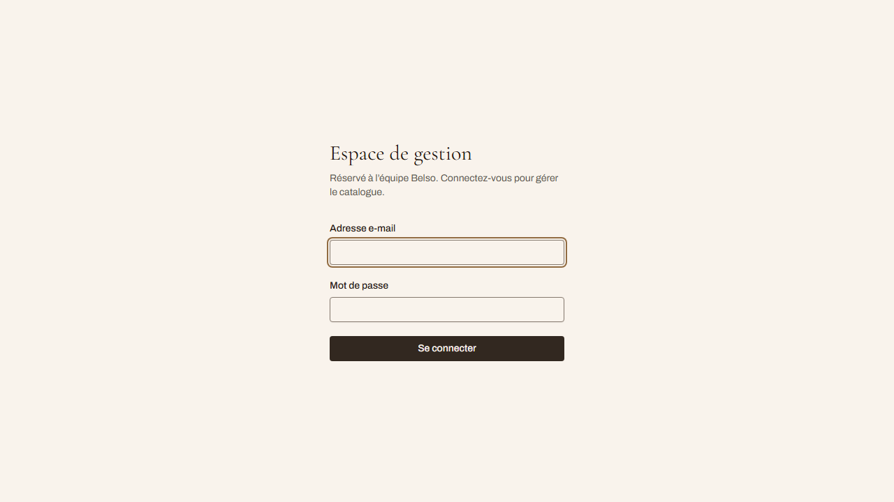
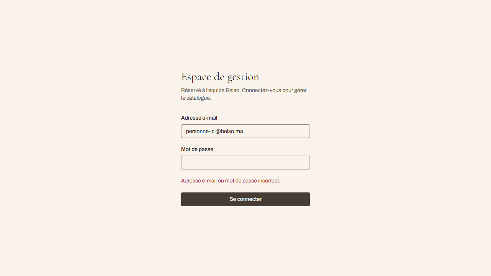
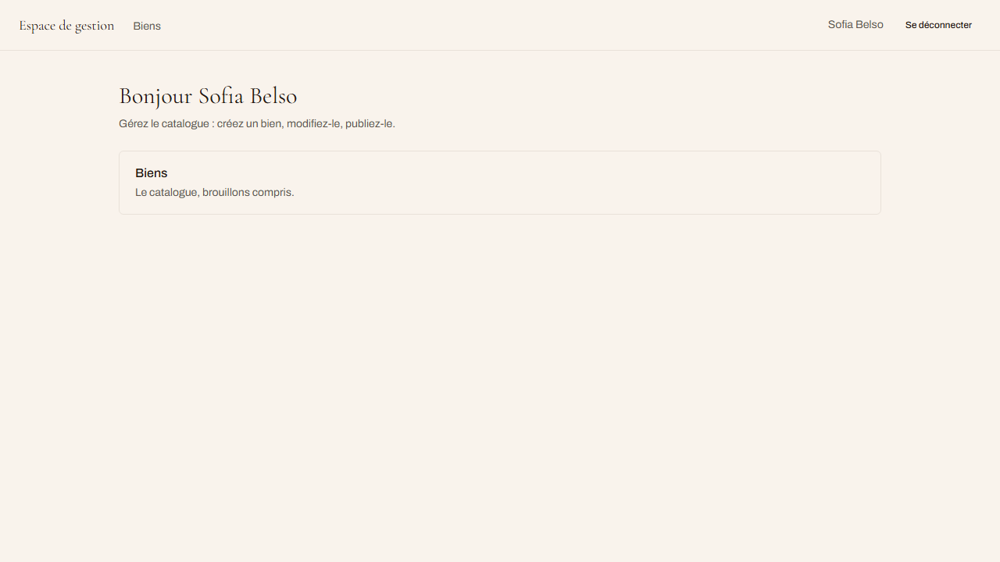
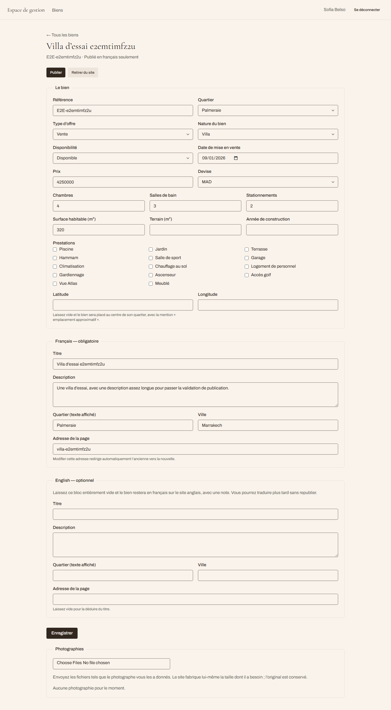
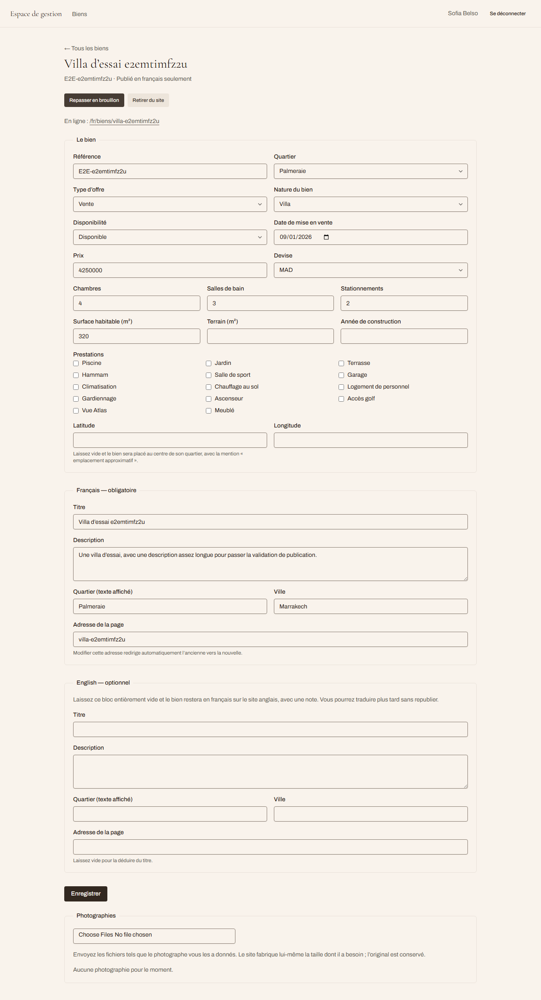
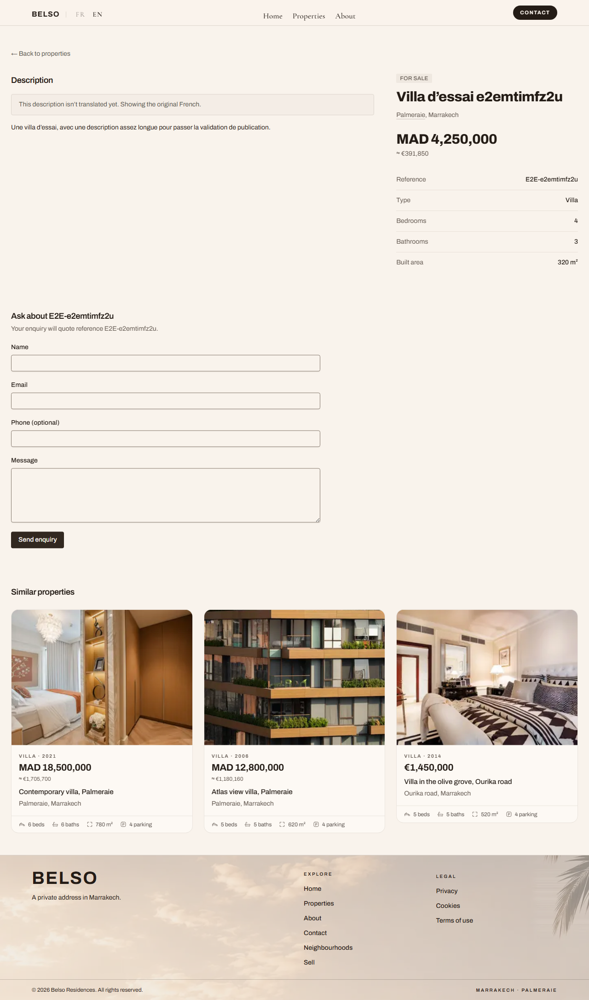
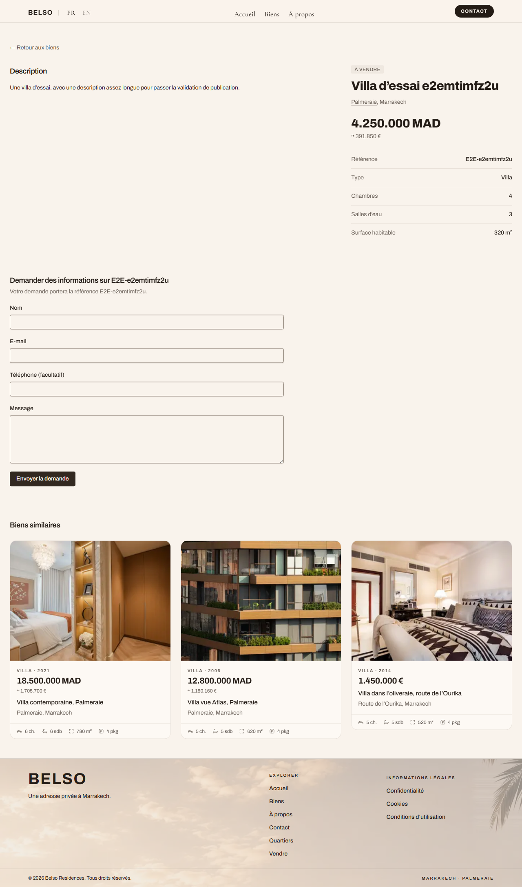
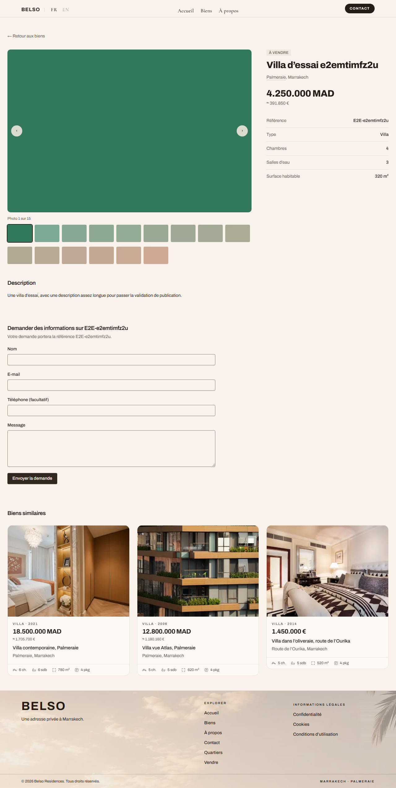
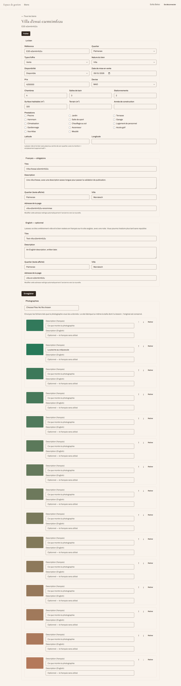
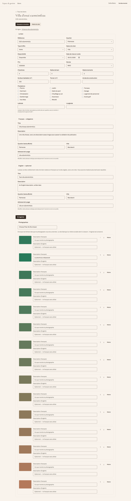

# Feature report — 011 The client publishes a listing without a developer

- **Spec:** [spec.md](../../specs/011-belso-back-office/spec.md) · [plan](../../specs/011-belso-back-office/plan.md) · [tasks](../../specs/011-belso-back-office/tasks.md)
- **Decisions:** [ADR-0010 — two database roles](../architecture/decisions/0010-two-database-roles.md) · [ADR-0011 — sessions in Postgres, scrypt, no auth library](../architecture/decisions/0011-sessions-in-postgres.md)
- **Branch / commits:** `main` · 12 commits · **97 files, +11 439 / −167**
- **Date:** 2026-09-01 · **Author:** Houssem Ferrani (+ Claude)

## What and why

Spec 010 put the catalogue in a database and then left it unreachable: the only ways in were a
migration, a seed script, or SQL over an SSH tunnel, so the client still could not add a property
without a developer — the thing she asked for and the reason spec 010 existed. This spec gives her
the back-office: she signs in, drafts a listing privately, publishes it in French alone, adds
English whenever she likes, renames it without breaking the address she already gave people,
uploads and orders photographs, and takes a sold property off the site without destroying it.

Reading the enquiries was split into [spec 012](../../specs/012-belso-inbox/spec.md), because the
notification needs a mail provider nobody has chosen, and holding the editor hostage to that choice
would have left the client unable to add a property for the sake of a feature about reading
messages.

## Acceptance criteria → evidence

| AC                 | What it claims                                                                                                   | Proven by                                                                             | Screenshot           | Verdict |
| ------------------ | ---------------------------------------------------------------------------------------------------------------- | ------------------------------------------------------------------------------------- | -------------------- | ------- |
| **AC-1** (pages)   | Signed out, every back-office address redirects and leaks no listing                                             | `e2e/admin-auth.spec.ts:44`                                                           | [50](#50)            | ✓       |
| **AC-1** (actions) | A signed-out POST to any action refuses and writes nothing                                                       | `admin-actions.test.ts` — list **derived from the module**, all 9 exports             | —                    | ✓       |
| **AC-2**           | A draft is saved, visible to her, and absent from the catalogue, its own URL, the district pages and the sitemap | `admin-actions.test.ts`; `e2e/listing-editor.spec.ts:72`; `e2e/draft-listing.spec.ts` | [60](#60)            | ✓       |
| **AC-3**           | French-complete publishes; French-incomplete is refused and the missing fields are named                         | `admin-actions.test.ts`; `e2e/listing-editor.spec.ts:117`                             | [61](#61), [62](#62) | ✓       |
| **AC-3b**          | English added later appears without republishing, and the untranslated note disappears by itself                 | `admin-actions.test.ts`; `e2e/listing-editor.spec.ts:165`                             | [63](#63)            | ✓       |
| **AC-4**           | Archiving removes it from the catalogue and destroys nothing                                                     | `e2e/listing-editor.spec.ts:388`                                                      | [65](#65)            | ✓       |
| **AC-5**           | After a rename, the address she published still resolves                                                         | `e2e/listing-editor.spec.ts:366`                                                      | [64](#64)            | ✓       |
| **AC-6**           | A camera-sized upload is served resized, the original kept, EXIF stripped                                        | `e2e/listing-editor.spec.ts:216`; `media.test.ts`                                     | [66](#66), [67](#67) | ✓       |
| **AC-9**           | Repeated wrong passwords are throttled; the response does not reveal whether the email exists                    | `actions.test.ts`; `login-throttle.db.test.ts`; `e2e/admin-auth.spec.ts:107`          | [51](#51)            | ✓       |
| **AC-10**          | A second concurrent save is told the listing changed rather than overwriting                                     | `admin-actions.test.ts` (unit; the concurrency case holds a row lock)                 | —                    | ✓       |

Two notes a reviewer should not have to dig for.

**AC-1's action half was unpinned until the review board.** The unit test enumerated five of nine
exports by hand — the four photograph actions, including the one that deletes and the one that
writes files to disk, were missing from a test named "on every export". The list is derived from
the module now, with an explicit roster so a disappearing export is as loud as a new one. The e2e
half cannot carry that weight: it posts a deliberately made-up `Next-Action` id, so it never
dispatches to an action and would pass with `requireSession()` removed from all nine. It is
retained as a smoke test of the endpoint and is no longer cited as evidence for the criterion.

**AC-9's HMAC keying is still unasserted.** `login-throttle.ts` falls back to a plain SHA-256 when
`THROTTLE_SECRET` is absent, and no test distinguishes the two branches — deleting `createHmac`
leaves every suite green. Listed under follow-ups.

## Screenshots

Captured by `FEATURE=011-belso-back-office pnpm e2e:shots`, which regenerates all eleven. It
produced one of them until 31/08: the command greps `@cuj` and only a single editor test carried
the tag.

**50 — signed out, every admin address redirects to sign in**

**51 — a wrong password and an unknown address say the same thing, in the same time**

**52 — signed in: the catalogue, drafts included**

**60 — a draft, saved and invisible to the public site**

**61 — published, and live on the French site**

**62 — the same listing on the English site: French text, untranslated note, nothing hidden**

**63 — English added later; the note is gone and the French page did not move**

**64 — renamed, and the address she had already given out still arrives**

**65 — archived: off the catalogue, record and photographs intact**

**66 — fifteen camera-sized photographs uploaded, each with its own description fields**

**67 — reordered; the caption travels with the photograph**

## Changes

| Layer                | Files | What arrived                                                                                                                                                               |
| -------------------- | ----- | -------------------------------------------------------------------------------------------------------------------------------------------------------------------------- |
| `src/features/`      | 23    | `admin/` (scrypt passwords, two-axis login throttle, sign-in); `properties/` gains every catalogue write, the media pipeline, the editor and photograph-manager components |
| `src/core/`          | 8     | `session.ts` + `session-cookie.ts`; `db.ts` gains the second pool; `env.ts` gains two connections, the media root and two production guards                                |
| `src/app/`           | 7     | A **third root layout** for `/admin`, the dashboard gate, the editor routes, and the media route handler                                                                   |
| `src/components/ui/` | 4     | `textarea`, `select`, and their tests                                                                                                                                      |
| `db/migrations/`     | 2     | `0005` accounts, sessions, `properties.version` + triggers, deferrable media constraint; `0006` the `belso_editor` role and its grants                                     |
| `scripts/`           | 5     | `admin-user.mjs`, `vps/belso-roles.sh`, `lib/env-local.mjs`, `measure-upload.mjs`                                                                                          |
| `e2e/`               | 4     | `admin-auth`, `listing-editor`, `draft-listing`, `global-setup`                                                                                                            |

### Decisions worth knowing

- **Two database roles, not one** (ADR-0010). The storefront connects as `belso_app`, which may
  select the catalogue and insert an enquiry and nothing else — it cannot read an enquiry back, let
  alone write a listing. `DATABASE_EDITOR_URL` **never falls back** to `DATABASE_URL`: a fallback
  would restore exactly the privilege the second role exists to remove, while looking like a
  kindness to whoever forgot to set it.
- **Sessions are a table, not a token** (ADR-0011). Disabling an account takes effect on the next
  request rather than at the end of a seven-day JWT. The cookie carries a random token; the
  database stores only its SHA-256, so a `pg_dump` in a support thread is not a stack of live
  sessions.
- **The proxy is not the gate.** It checks only that a cookie exists, because verifying more means
  asking Postgres and it runs on Edge. The authority is the admin layout for pages and
  `requireSession()` on line one of every action — a Server Action is reachable without the page it
  lives on ever rendering, which is why AC-1 states both halves separately.
- **A third root layout** for `/admin`, so `<html lang>` is French. A nested layout cannot change
  it, and the back-office announcing French prose as English is a screen-reader defect.
- **Publishing is stricter than saving.** The save schema is deliberately loose so a morning's
  half-finished work is never lost; the publish schema names the missing French fields.

## Verification

| Gate                                     | Result                                                                                |
| ---------------------------------------- | ------------------------------------------------------------------------------------- |
| `pnpm verify`                            | ✓ lint (0 errors), typecheck, format, docs, typography, secrets, **285 tests**, build |
| `pnpm test:db`                           | ✓ **47 passed**                                                                       |
| `pnpm verify:db`                         | ✓ migrate · seed · 47 tests · restore-check                                           |
| `CI=true pnpm e2e`                       | ✓ **95 passed, 3 skipped, 0 failed** (`db-down`, which wants `DB_DOWN=1`)             |
| `/security-review`                       | **APPROVE**, no P1                                                                    |
| Review board — arch / sec / qa / product | REQUEST CHANGES ×4; all P0 and P1 findings closed                                     |

**`db:restore-check` is the gate worth reading.** It dumps the live database, restores it, and runs
the site's own catalogue query against the copy — so it asserts that the storefront could serve
from the backup, not merely that rows arrived. It failed until 01/09, because `0005` and `0006` had
been applied to `belso_test` and never to production: `row.ts` selects `p.version` in the one query
every public read goes through, so deploying this spec beforehand would have returned 500 on every
catalogue page, listing and district — not only on `/admin`. Production was migrated after a fresh
dump, with row counts identical either side (20 properties, 39 translations, 149 photographs).

**The e2e figure needs one caveat.** `admin-auth.spec.ts` and `listing-editor.spec.ts` skip
themselves without `BELSO_E2E_ADMIN_*`, and on this machine they were skipping — so a green summary
with ten skips was not the same as a green summary. They run in the figure above. The equivalent
number recorded on the previous machine was taken under the same condition and should not be
treated as an independent confirmation.

### What the review board found

Eleven findings; the two P0s and every P1 are closed. Three shared one shape — **a check that
reported green because it never ran**:

1. the e2e scratch-database guard read `DATABASE_URL` from its own process while the server read
   `.env.local`, so it judged "no database" while one was connected — and it never checked
   `DATABASE_EDITOR_URL` at all, which is the connection every back-office write uses;
2. `e2e/global-setup.ts` inherited that blindness and stopped clearing the rate limiters, so a
   second run within an hour failed its enquiry tests with the form reporting a throttle;
3. `pnpm test:db` skipped itself entirely after a refactor left a side-effect import that no longer
   had a side effect.

A fourth was a WCAG 4.1.2 failure hiding behind good fixtures: `altFor` returns `""` for a
photograph the client never described, which became `aria-label=""` on its thumbnail — fifteen
controls with no accessible name. No test could see it, because **every fixture photograph carries
alt text**, so the branch is unreachable from seeded data and appears only on listings written
through this feature.

## Follow-ups

Consciously open, in the order they matter.

- **The editor does not ask for photograph descriptions, or say how many are missing.** The product
  review rates this P1. `publishableSchema` says nothing about alt text and the editor publishes
  fifteen empty description fields without comment, while the spec calls this "the field most
  likely to be skipped, and the one the site has already been burned by". The recommendation is a
  count beside the publish button — a warning, never a blocker, because the spec already refused
  that trade for translations. **A floor is in place**: no gallery control is ever unnamed
  (`gallery.test.tsx`), so the accessibility failure is fixed even where the copy is absent.
- **`belso_editor` has no password on production.** `0006` creates the role without one by design;
  `scripts/vps/belso-roles.sh` provisions it. Deploy-time step.
- **CSP is still `Report-Only` with `script-src 'unsafe-inline'`** (SEC-NET-002). Defensible for a
  read-only storefront, less so now there is a session cookie. Wants a real domain to tune against.
- **`X-Forwarded-For` is trusted unverified** (SEC-RATE-003). The login limiter inherited the
  enquiry limiter's code without its caveat; the network axis only holds if Traefik sanitises
  client-supplied forwarded headers, and nothing in the repository confirms that it does.
- **Three tests the board asked for and did not get:** the HMAC-versus-bare-hash branch in
  `login-throttle`, the `Secure` cookie flag, and four gaps in `env.test.ts` (an empty
  `DATABASE_URL`, a non-postgres URL, the `DATABASE_EDITOR_URL` warning, `mediaRoot`).
- **Reordering fifteen photographs is fourteen clicks.** Product ruled ship-as-is: AC-6 asks only
  that she orders them, and `plan.md`'s drag-to-reorder is more surface than the problem justifies
  for a client who has not used the editor once. The cheap version, if it is ever wanted, is a
  "make this the cover" button reusing the existing reorder payload.
- **There is no CI.** Every gate here was run by hand. A workflow running `pnpm verify` on push
  needs no secrets and would have caught the prerender failure that reached a branch during this
  spec.
- **B-2 (no domain) and B-9 (no privacy notice owner) still gate production**, and neither is
  technical.

---

_Generated by `/feature-report`. `pnpm report:pdf 011-belso-back-office` renders this for sharing
outside the repository._
